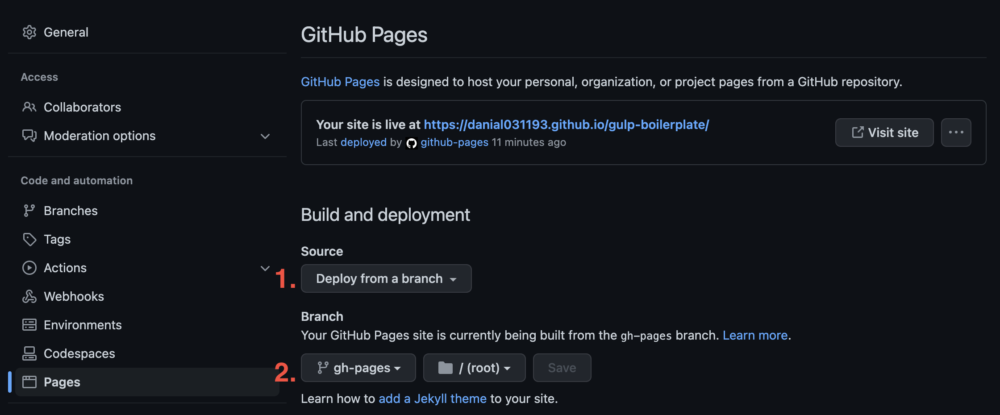

# Gulp boilerplate
### [DEMO](https://danial031193.github.io/gulp-boilerplate/)

## Scripts

### Run dev server
```
npm start
```

### Build files without server
```
npm build
```

## Automatic deploy to Github Pages

(If this is not needed, then just delete the ".github" folder at root)
#### ***The repository must be public for this to work!***

#### Base config steps:
1. Replace base tag at "src/common/components/layout.pug:11"
   - URL Example: "https://[github username].github.io/[github repo name]/"
2. Configure site preview in repository settings


## Source structure

- assets
  - fonts
  - images
    - ...page folder...
      - ...section folder...
  - styles
  - data.json
- common
  - components
    - footer
    - header
    - ...new global component...
      - index.pug
      - index.pug
    - layout.pug
- pages
  - home
    - ...section...
      - index.pug
      - styles.scss
    - index.pug
    - styles.scss
  - ...new page...

## Page layout

```jade
include /src/common/components/layout

+layout('Home page')
  section
    .container
      ...LAYOUT...
```

## Data.json

### Structure

```json
{
  "header": {
    "menu": [
      {
        "label": "About Us",
        "link": "#preview"
      },
      {
        "label": "Services",
        "link": "#services"
      },
      {
        "label": "Portfolio",
        "link": "#portfolio"
      },
      {
        "label": "Blog",
        "link": "#blog"
      }
    ]
  },
  "footer": {
    ...data...
  },
  "PAGE_NAME": {
    "SECTION_NAME_1": {
      ...data...
    },
    "SECTION_NAME_2": {
      ...data...
    }
  }
}
```

### How to use

```jade
menu.header__navigation
  each item in header.menu
    +headerItem(item.label, item.link)
```
